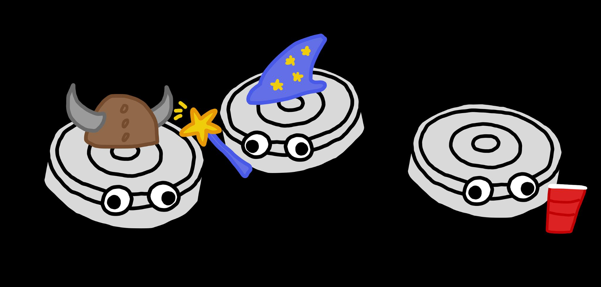

# Multi-Agent Robotic Sumo Simulation & Training



Welcome to the repository for Ludus Labs' **AI Roomba Fight Hackathon**! This repository is a platform for simulating, training, and evaluating autonomous roomba agents in competitive sumo-style environments. It supports scalable reinforcement learning, self-play, and sim2real transfer for real (jailbroken) Roombas. 

## Features

- **Physics-Accurate Sumo Environments**: Built on MuJoCo and PettingZoo for realistic multi-agent simulation.
- **Plug-and-Play RL Training**: Out-of-the-box PPO self-play with curriculum learning and vectorized environments.
- **Sim2Real Transfer**: Tools and code for deploying trained agents to real Roomba robots.
- **Extensible Models**: Modular neural network architectures and easy algorithm prototyping.
- **Visualization & Evaluation**: Watch agent battles and analyze performance with TensorBoard.

---

## Quickstart

### 1. Installation

**Prerequisites:**
- Python 3.12
- [MuJoCo](https://mujoco.org/) (see their docs for license and install)

**Install dependencies:**
```bash
uv sync
```
Or, if you use pip:
```bash
pip install -r requirements.txt
```

### 2. Train Your First Roomba Agent

```bash
python train.py --total-timesteps 100_000_000 --n-envs 1024
```
- Trains a PPO agent for 100M timesteps using 1024 parallel environments.
- Checkpoints are saved in `checkpoints/`.
- Training logs are written to `runs/` for TensorBoard.

### 3. Watch Your Agent Compete

```bash
python watch.py --ckpt1 checkpoints/your_model.pt --episodes 5
```
- Visualizes matches between trained agents.

### 4. Monitor Training

```bash
tensorboard --logdir runs/
```
Open [http://localhost:6006](http://localhost:6006) to view live metrics.

---

## Project Structure

| Folder/File         | Purpose                                                                 |
|---------------------|-------------------------------------------------------------------------|
| `environments/`     | Sumo environments, MuJoCo XMLs, wrappers for RL                         |
| `models/`           | Neural network architectures and agent baselines                        |
| `train.py`          | Main PPO self-play training script                                      |
| `watch.py`          | Visualize and evaluate trained agents                                   |
| `evaluate.py`       | Automated evaluation utilities                                          |
| `server/`           | Code for joystick control, neural agent deployment, and networking      |
| `pico/`             | Microcontroller code for real Roomba integration                        |
| `checkpoints/`      | Saved model weights                                                     |
| `runs/`             | TensorBoard logs                                                        |
| `docs/`             | Documentation and assets                                                |
| `utils.py`          | Utility functions (device selection, seeding, etc.)                     |

---

## Sumo Environment

- **Objective**: Push your opponent out of the ring while staying in yourself.
- **Match Duration**: 60 seconds max.
- **Victory**: +1000 reward for pushing out opponent, -1000 for being pushed out, -1000 each for a draw.

### Realistic Octagon Arena

The simulated sumo ring is modeled as an **octagon**, matching the physical arena used in our living room. This ensures that strategies learned in simulation transfer effectively to the real-world setup, minimizing the sim2real gap.

### Multiple Sensor Modes (XMLs)

You can choose between four different environment XMLs, each representing a different sensor configuration for the Roombas:

- **Native Roomba Sensor Modes** (3 variants):
  - `b`: Bump sensors only
  - `br`: Bump + Range sensors
  - `brc`: Bump + Range + Cliff sensors
  These modes use the actual sensors available on the physical Roombas, allowing you to experiment with various levels of perception and robustness.

- **Ultra Wide Band (UWB) Mode**:
  - `uwb`: Uses simulated ultra wide band sensors for localization, providing more precise position information. Ideal for advanced strategies or when testing with additional hardware in the real world.

You can select the mode by setting the `env_mode` parameter when creating the environment or running training scripts.

**Example:**
```python
# In train.py or watch.py
env = Sumo(mode="brc")  # Use bump, range, and cliff sensors
```

**Robot Model**:  
- Two motorized wheels (differential drive)
- Range sensors for obstacle/opponent detection

**Action Space**:  
- Continuous torques for left/right wheels (range: [-1, 1])

**Observation Space**:  
- Includes wheel torques and sensor readings (see environment code for details)

---

## Advanced Usage

- **Custom Rewards**: Tweak reward shaping in `environments/sumo_v1.py`.
- **Model Architectures**: Modify or extend in `models/`.
- **Algorithm Prototyping**: Use `train.py` as a template for new RL algorithms.
- **Sim2Real**: Use `server/` and `pico/` for deploying to real robots.

---

## Extending the Platform

- Add new environments by creating MuJoCo XMLs and corresponding Python wrappers.
- Implement new agent models in `models/`.
- Contribute documentation in `docs/` and per-folder `README.md` files.

---

## Contributing

Contributions are welcome! Please open issues or pull requests for bug fixes, new features, or documentation improvements.

---

## License

[MIT License](LICENSE) (or specify your license here)

---

## Acknowledgements

- Built with [MuJoCo](https://mujoco.org/), [PettingZoo](https://www.pettingzoo.ml/), and [PyTorch](https://pytorch.org/).

---

**For more details, see the documentation in each folder and the code comments.**
